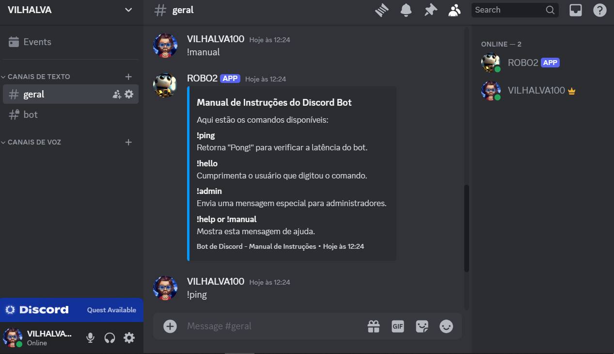
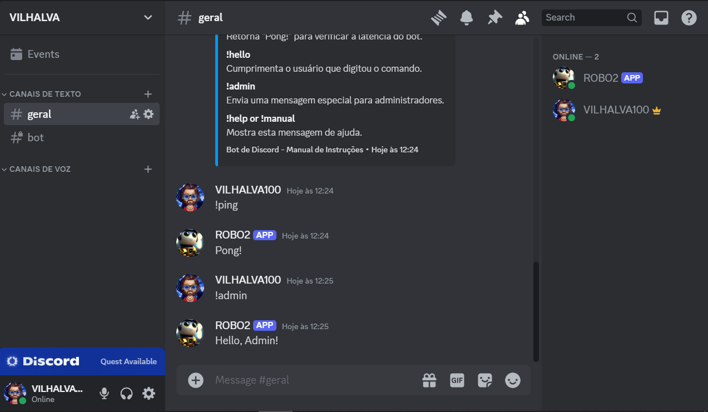

# COMANDOS NO DISCORD 
🤖ESTE É UM BOT DO DISCORD FEITO COM DISCORDJS QUE RESPONDE A COMANDOS BASICOS.

 <br>
 <br>

## DESCRIÇÃO:
1. **Comando `!ping`**:
   - Ao digitar `!ping`, o bot responde com "Pong!", mostrando que está online e respondendo aos comandos.

2. **Comando `!hello`**:
   - Digitar `!hello` faz com que o bot cumprimente o usuário que digitou o comando, mencionando o nome de usuário dele.

3. **Comando `!admin`**:
   - Este comando envia uma mensagem especial para administradores do servidor. No exemplo fornecido, ele simplesmente responde com "Hello, Admin!", mas pode ser personalizado para realizar ações administrativas específicas.

4. **Comando `!help` ou `!manual`**:
   - Ao digitar `!help` ou `!manual`, o bot exibe um manual de instruções em formato embed. Este manual inclui uma lista dos comandos disponíveis e suas descrições.

## EXECUTANDO O PROJETO:
1. **Editar o código:**
   - Configure o arquivo `CODIGO/config.json` com o token do seu bot, que podem ser obtidas no [Discord Developer Portal](https://discord.com/developers/applications), e o prefixo desejado para os comandos (`!` no exemplo).

2. **Instalando as Depêndencias:**
   - Para instalar as dependências listadas no arquivo "package.json", você pode usar o comando `npm install` no terminal. Certifique-se de estar no diretório do seu projeto onde o arquivo "package.json" está localizado (`CODIGO`). O npm irá ler o arquivo "package.json" e instalar todas as dependências listadas nele. 

   ```bash
   npm install
   ```

3. **Inicie o Bot:**
   - Para usar o `NODE`, inicie o bot com o seguinte comando:
    ```bash
    npm start
    ```

    - Para usar o `NODEMON`, inicie o bot com o seguinte comando:
    ```bash
    npm test
    ```

4. **No Discord**:
   - Certifique-se de que o bot está online no servidor Discord onde foi adicionado.
   - Digite os comandos no canal de texto apropriado:
     - `!ping` para verificar a latência do bot.
     - `!hello` para receber um cumprimento personalizado.
     - `!admin` para acessar funcionalidades administrativas (neste caso, uma saudação especial).
     - `!help` ou `!manual` para visualizar o manual de instruções do bot.

5. **Personalização**:
   - Modifique o código do bot conforme necessário para adicionar mais comandos ou alterar o comportamento dos comandos existentes.
   - Personalize a mensagem de ajuda (`!help`) para incluir informações adicionais ou comandos específicos ao seu servidor Discord.
  
## NÃO SABE?
- Entendemos que para manipular arquivos em muitas linguagens e tecnologias relacionadas, é necessário possuir conhecimento nessas áreas. Para auxiliar nesse aprendizado, oferecemos cursos gratuitos disponíveis:
* [CURSO DE DISCORDJS](https://github.com/VILHALVA/CURSO-DE-DISCORDJS)
* [CURSO DE JAVASCRIPT](https://github.com/VILHALVA/CURSO-DE-JAVASCRIPT)
* [CURSO DE NODEJS](https://github.com/VILHALVA/CURSO-DE-NODEJS)
* [CONFIRA MAIS CURSOS](https://github.com/VILHALVA?tab=repositories&q=+topic:CURSO)

## CREDITOS:
- [PROJETO CRIADO PELO VILHALVA](https://github.com/VILHALVA)

